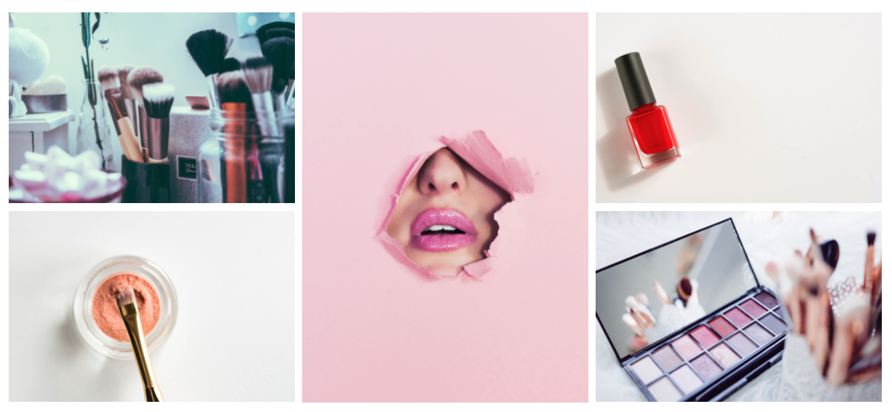
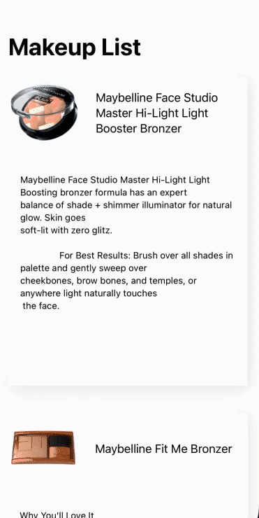

# makeup-app-study
iOS native app study by @marialuisacp

## About project
This code is a study of iOS native applications. I'd used this technologies to build this app:

 - Xcode 12
 - Swift 5
 - SwiftUI
 - Unit tests

The only purpouse of this project is study and learning more about iOS development and Swift code. 

## API

The project consumes a public API called [Makeup API](https://makeup-api.herokuapp.com/) wich provides too many endpoints, containing for example, a list of makeup products of too many brands and categories.

## Images

